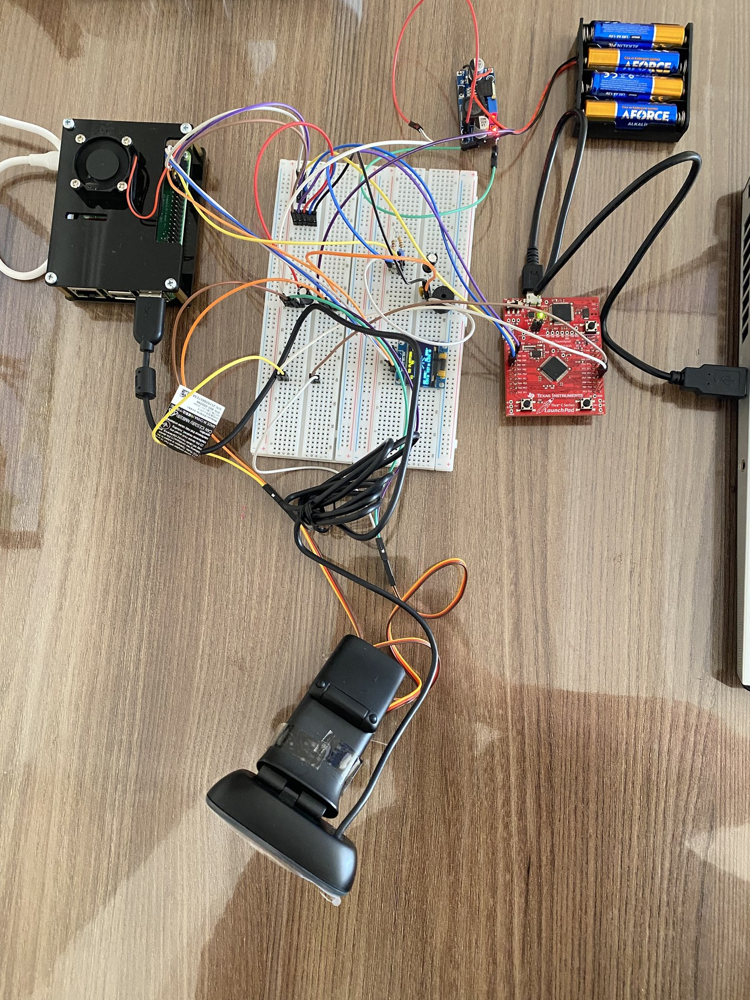
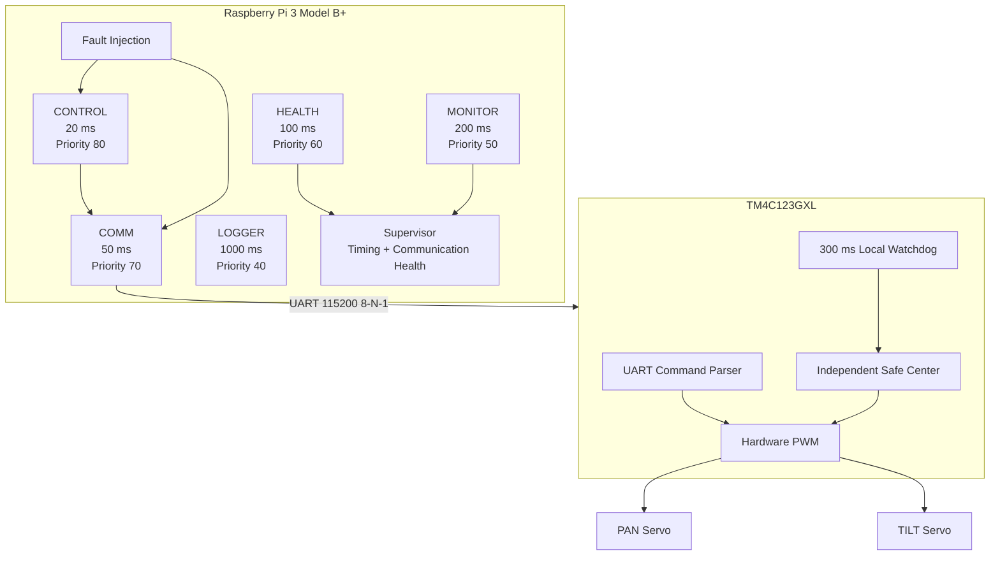
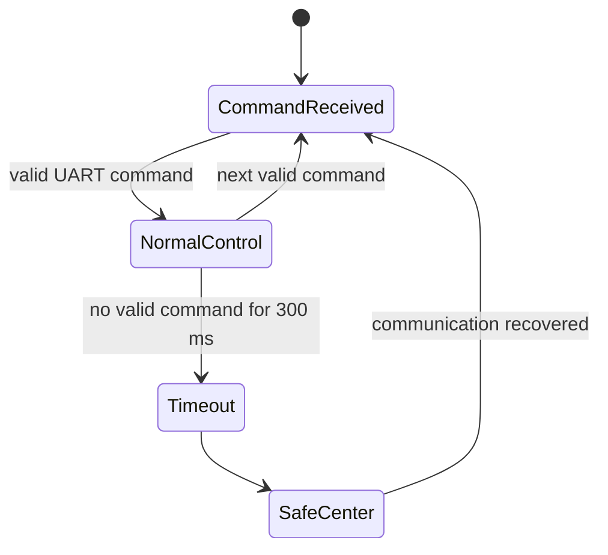
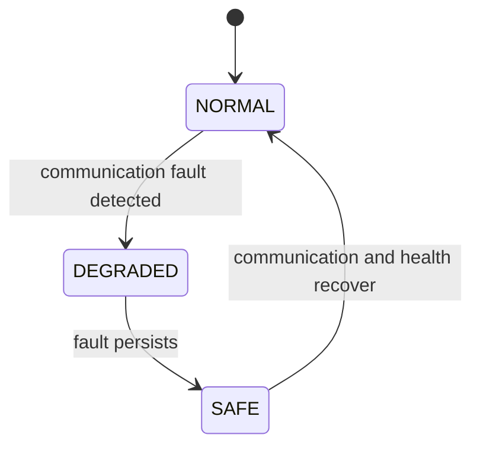

# Real-Time Fault-Tolerant Dual-Axis Actuator Control

<p align="center">
  <b>Raspberry Pi 3 Model B+ + TM4C123GXL | POSIX Real-Time Scheduling | UART | Hardware PWM | Fault Injection | Fail-Safe Control</b>
</p>

A dual-processor embedded control testbed built to study **real-time scheduling, timing faults, communication failures, priority inversion, recovery mechanisms, and deterministic actuator control on real hardware**.

The Raspberry Pi executes the high-level real-time workload and supervision logic. The TM4C123GXL owns low-level PAN/TILT PWM generation and provides an **independent 300 ms communication watchdog**, so actuator safety does not depend entirely on Linux remaining healthy.

> **Final powered validation:** 5,160 periodic jobs, 1,261 successful UART transactions, **0 deadline misses**, and **0 UART failures** during a 60-second physical run.

## Quick Navigation

- [Physical Prototype](#physical-prototype)
- [System Architecture](#system-architecture)
- [Real-Time Task Set](#real-time-task-set)
- [Experiment 1 — Linux Scheduler Baseline](#experiment-1--linux-scheduler-baseline)
- [Experiment 2 — Raspberry Pi ↔ TM4C123 Integration](#experiment-2--raspberry-pi--tm4c123-integration)
- [Experiment 3 — Independent Communication Watchdog](#experiment-3--independent-communication-watchdog)
- [Experiment 4 — Communication-Loss Fault State Machine](#experiment-4--communication-loss-fault-state-machine)
- [Experiment 5 — Raw Deadline Overload](#experiment-5--raw-deadline-overload)
- [Experiment 6 — Supervised Timing-Fault Recovery](#experiment-6--supervised-timing-fault-recovery)
- [Experiment 7 — Priority Inversion](#experiment-7--priority-inversion)
- [Experiment 8 — Rate Monotonic vs Deadline Monotonic](#experiment-8--rate-monotonic-vs-deadline-monotonic)
- [Final 60-Second Physical Validation](#final-test--60-second-powered-physical-validation)
- [Problems Encountered During Development](#problems-encountered-during-development)

---

## Physical Prototype

The final test platform combines a Raspberry Pi 3 Model B+, TM4C123GXL LaunchPad, two MG90S servos, a dual-axis bracket, an external 5 V actuator supply, and shared-ground UART communication.

<p align="center">
  
</p>

The hardware image above is built only from photographs of this project: the complete controller setup, external servo-power wiring, and controller-side assembly used during development.

### Visual Evidence Gallery

Every image below comes from this repository's own measured runs. The gallery is deliberately arranged as a quick technical story: scheduler behavior, injected faults, recovery, concurrency behavior, deadline-policy comparison, and final physical validation.

<table>
<tr>
<td width="50%" align="center"><b>Scheduler timing</b><br><br><sub>SCHED_OTHER and SCHED_FIFO measurements from the Raspberry Pi timing experiments.</sub></td>
<td width="50%" align="center"><b>Timing-fault supervision</b><br><br><sub>CONTROL deadline-overrun fault with timing-aware supervision enabled.</sub></td>
</tr>
<tr>
<td width="50%" align="center"><b>Priority inversion mitigation</b><br><br><sub>Measured HIGH-priority blocking before and after PTHREAD_PRIO_INHERIT.</sub></td>
<td width="50%" align="center"><b>RM vs DM</b><br><br><sub>The constrained-deadline URGENT_B task misses under RM and is protected under DM.</sub></td>
</tr>
<tr>
<td width="50%" align="center"><b>60 s physical timing result</b><br><br><sub>Measured timing statistics from the powered final validation.</sub></td>
<td width="50%" align="center"><b>60 s communication health</b><br><br><sub>1,261 successful UART transactions, zero failures, HEALTHY final state.</sub></td>
</tr>
</table>

### Hardware used

| Component | Role |
|---|---|
| Raspberry Pi 3 Model B+ | High-level real-time scheduler, supervision, fault injection, measurements and logging |
| TM4C123GXL LaunchPad | Deterministic low-level actuator control and independent fail-safe |
| 2 × MG90S servo | PAN and TILT actuation |
| Dual-axis pan-tilt bracket | Mechanical platform |
| External regulated 5 V supply | Servo power |
| Breadboard + jumper wiring | Signal and power distribution |
| Smoothing capacitor | Reduces servo-supply disturbances |

### Mechanical safety limits

| Axis | PWM output | Minimum | Center / safe | Maximum |
|---|---|---:|---:|---:|
| PAN | PB6 / M0PWM0 | 45° | 90° | 135° |
| TILT | PB7 / M0PWM1 | 55° | 90° | 125° |

The servos are **not powered from the Raspberry Pi rail**. They use the external 5 V source, while Raspberry Pi and TM4C123 share ground for a valid UART reference.

---

## What the System Does

The project is not simply a pan-tilt mechanism. The actuator is the physical endpoint of a real-time experiment platform.

The system was built to demonstrate:

- POSIX `SCHED_FIFO` fixed-priority scheduling
- Rate Monotonic periodic task organization
- release-jitter measurement
- execution-time measurement
- response-time measurement
- deadline-miss detection
- Raspberry Pi ↔ TM4C123 UART communication
- hardware PWM actuator control
- local communication watchdog behavior
- fault injection
- `NORMAL → DEGRADED → SAFE → NORMAL` recovery
- overload containment through supervision and workload shedding
- priority inversion and priority inheritance
- Rate Monotonic vs Deadline Monotonic scheduling
- long-run physical validation

---

## System Architecture



The split is intentional:

**Raspberry Pi**
- schedules periodic services
- generates actuator setpoints
- measures timing
- detects faults
- changes system state
- records experimental results

**TM4C123**
- parses actuator commands
- generates hardware PWM
- enforces angle limits
- monitors communication locally
- centers the actuators independently if communication disappears

This gives the platform two levels of protection instead of making the physical actuator completely dependent on a Linux process.

---

## Real-Time Task Set

The main physical experiment uses five periodic services.

| Service | Period | Priority | Purpose |
|---|---:|---:|---|
| CONTROL | 20 ms | 80 | Generate/update actuator-control setpoint |
| COMM | 50 ms | 70 | Exchange commands with TM4C123 over UART |
| HEALTH | 100 ms | 60 | Evaluate communication and timing health |
| MONITOR | 200 ms | 50 | Observe system state and supervisory information |
| LOGGER | 1000 ms | 40 | Record low-rate experiment status |

This assignment follows Rate Monotonic ordering: shorter periods receive higher fixed priorities.

---

# Experiment 1 — Linux Scheduler Baseline

The first objective was to measure how the CONTROL task behaves under the default Linux scheduler and under POSIX real-time scheduling.

CONTROL parameters:

```text
Period   : 20 ms
Deadline : 20 ms
Cycles   : 1000
```

Four measurement sets were collected:

1. `SCHED_OTHER` without generated CPU load
2. `SCHED_FIFO` without generated CPU load
3. `SCHED_OTHER` under CPU load
4. `SCHED_FIFO` under CPU load

### Measured timing results

| Condition | Avg jitter | Worst jitter | Avg response | Worst response | Misses |
|---|---:|---:|---:|---:|---:|
| SCHED_OTHER / no load | 82.074 µs | 212.422 µs | 164.325 µs | 296.953 µs | 0 / 1000 |
| SCHED_FIFO / no load | 21.618 µs | 77.969 µs | 101.880 µs | 196.288 µs | 0 / 1000 |
| SCHED_OTHER / CPU load | **120.019 µs** | **8203.196 µs** | 156.095 µs | **8239.341 µs** | 0 / 1000 |
| SCHED_FIFO / CPU load | **10.052 µs** | **60.820 µs** | 46.066 µs | **97.278 µs** | 0 / 1000 |

The most important comparison is the CPU-load case: average release jitter fell from **120.019 µs to 10.052 µs**, while the observed worst jitter dropped from **8203.196 µs to 60.820 µs**.

<p align="center">
  
</p>
<p align="center"><sub>Average release jitter across the four scheduler/load conditions.</sub></p>

<p align="center">
  
  
</p>
<p align="center"><sub>Left: release jitter under CPU load. Right: response time under the same load.</sub></p>

### Raw measurement data

- [SCHED_OTHER baseline CSV](results/csv/control_timing_sched_other_baseline.csv)
- [SCHED_FIFO baseline CSV](results/csv/control_timing_sched_fifo_baseline.csv)
- [SCHED_OTHER CPU-load CSV](results/csv/control_timing_sched_other_load.csv)
- [SCHED_FIFO CPU-load CSV](results/csv/control_timing_sched_fifo_load.csv)

---

# Experiment 2 — Raspberry Pi ↔ TM4C123 Integration

Before the full real-time application is allowed to run, the Raspberry Pi verifies the MCU communication link.

UART configuration:

```text
Device    : /dev/serial0
Baud      : 115200
Data bits : 8
Parity    : none
Stop bits : 1
```

The command protocol intentionally stays small and observable:

```text
PING
PAN 70
PAN 110
TILT 70
TILT 110
CENTER
```

Expected responses include:

```text
ACK
PAN_OK
TILT_OK
CENTER_OK
```

The repository contains standalone tests so the communication layer can be validated before involving the complete scheduler:

- [UART PING test](tests/uart_ping_test.py)
- [Actuator command test](tests/actuator_command_test.py)
- [Watchdog fault test](tests/watchdog_fault_test.py)

This separation was useful during bring-up because a UART wiring/protocol problem could be isolated from a scheduling problem instead of debugging the entire stack at once.

The final physical run below is also the integration proof: COMM executes 1,200 periodic jobs while exchanging commands with the TM4C123, and the health summary ends with 1,261 successful transactions and zero failures.

<p align="center">
  
</p>

<p align="center"><sub>Physical UART integration evidence from the 60-second powered validation.</sub></p>

---

# Experiment 3 — Independent Communication Watchdog

A key design requirement was that the physical mechanism must not remain indefinitely at the last command if the Raspberry Pi stops communicating.

The TM4C123 therefore implements a **300 ms local watchdog**.



On timeout:

```text
PAN  -> 90°
TILT -> 90°
```

This decision is made locally by the microcontroller. Linux does not need to send a final `CENTER` command for the safe action to occur.

The corresponding firmware is in [`src/tm4c123/main.c`](src/tm4c123/main.c).

---

# Experiment 4 — Communication-Loss Fault State Machine

At Raspberry Pi level, communication health is also supervised.

The intended state sequence is:



During the injected complete UART-loss test, communication was removed between **4.0 s and 6.0 s**.

Observed summary:

```text
Successful transactions : 170
Failed transactions     : 40
Consecutive failures    : 0
Final system state      : NORMAL
```

Observed state transitions:

```text
t=4.000 s | NORMAL   -> DEGRADED | COMMUNICATION_LOSS
t=4.100 s | DEGRADED -> SAFE     | COMMUNICATION_LOSS
t=6.200 s | SAFE     -> NORMAL   | NONE
```

The 40 failed transactions are consistent with a two-second fault interval at a 50 ms COMM period.

---

# Experiment 5 — Raw Deadline Overload

The next fault was intentionally created inside the highest-priority CONTROL task.

Normal CONTROL timing:

```text
Period   : 20 ms
Deadline : 20 ms
```

Injected workload:

```text
25 ms
```

A 25 ms workload cannot consistently complete inside a 20 ms deadline. The purpose of the test was to observe how the failure propagates through a fixed-priority service set.

### Raw overload result

| Service | Deadline misses |
|---|---:|
| CONTROL | **100 / 500** |
| COMM | **41 / 200** |
| HEALTH | **20 / 100** |
| MONITOR | **10 / 50** |
| LOGGER | **2 / 10** |

The important result is not only that CONTROL failed. The high-priority overload delayed every lower-priority service and created a cascading timing failure.

Source: [`rt_deadline_fault_raw.c`](src/raspberry_pi/experiments/rt_deadline_fault_raw.c)

---

# Experiment 6 — Supervised Timing-Fault Recovery

The raw overload showed why detecting only UART errors is insufficient. If COMM itself is starved, it cannot run often enough to report communication failures.

The supervisor was therefore extended to monitor CONTROL deadline health directly.

Supervision parameters:

```text
Fault interval        : 4.0 s -> 6.0 s
SAFE threshold        : 3 consecutive CONTROL misses
Recovery requirement  : 25 healthy CONTROL cycles
```

Measured state changes:

```text
t=4.025 s | NORMAL   -> DEGRADED | CONTROL_DEADLINE_OVERRUN
t=4.075 s | DEGRADED -> SAFE     | CONTROL_DEADLINE_OVERRUN
t=6.480 s | SAFE     -> NORMAL   | NONE
```

### Deadline misses after supervision

| Service | Raw overload | Supervised |
|---|---:|---:|
| CONTROL | 100 / 500 | **3 / 500** |
| COMM | 41 / 200 | **1 / 200** |
| HEALTH | 20 / 100 | **0 / 100** |
| MONITOR | 10 / 50 | **0 / 50** |
| LOGGER | 2 / 10 | **0 / 10** |

<p align="center">
  
  
</p>
<p align="center"><sub>Measured terminal evidence: timing statistics on the left, state transition and recovery evidence on the right.</sub></p>

During `SAFE`, the deliberately faulty CONTROL workload is shed and new actuator motion is inhibited. Once timing remains healthy for the recovery interval, the system returns to `NORMAL`.

Source: [`rt_timing_fault_supervised.c`](src/raspberry_pi/fault_tolerance/rt_timing_fault_supervised.c)

---

# Experiment 7 — Priority Inversion

The project also reproduces a classic fixed-priority concurrency problem.

Three `SCHED_FIFO` threads run on one CPU:

```text
HIGH   priority 80
MEDIUM priority 60
LOW    priority 40
```

LOW enters a mutex-protected critical section. HIGH later requests that mutex and blocks. MEDIUM does not need the mutex, so it can preempt LOW and indirectly increase the time HIGH remains blocked.

### Measured result

| Configuration | HIGH blocking time |
|---|---:|
| Normal mutex | **220.222 ms** |
| `PTHREAD_PRIO_INHERIT` | **70.119 ms** |

Measured reduction:

```text
150.103 ms
68.16 %
```

<p align="center">
  
</p>
<p align="center"><sub>Actual terminal output from the single-core priority-inversion experiment.</sub></p>

Priority inheritance temporarily allows the low-priority mutex owner to inherit the blocked high-priority thread's priority, reducing interference from MEDIUM.

Source: [`priority_inversion_test.c`](src/raspberry_pi/experiments/priority_inversion_test.c)

---

# Experiment 8 — Rate Monotonic vs Deadline Monotonic

Rate Monotonic assigns priority according to task period. That is not always ideal when a task has a deadline much shorter than its period.

Test task set:

| Task | Execution C | Period T | Deadline D |
|---|---:|---:|---:|
| FAST_A | 8 ms | 40 ms | 40 ms |
| URGENT_B | 8 ms | 50 ms | **12 ms** |
| SLOW_C | 4 ms | 100 ms | 100 ms |

Nominal utilization:

```text
U = 8/40 + 8/50 + 4/100 = 0.400
```

### URGENT_B result

| Policy | Priority | Deadline misses | Worst response |
|---|---:|---:|---:|
| Rate Monotonic | 70 | **25 / 100** | **16.083 ms** |
| Deadline Monotonic | 80 | **0 / 100** | **8.112 ms** |

<p align="center">
  
</p>
<p align="center"><sub>Measured URGENT_B behavior: RM misses the 12 ms relative deadline; DM completes all 100 jobs without a miss.</sub></p>

The experiment demonstrates why relative deadline can matter more than period for constrained-deadline systems.

Source: [`rm_vs_dm_test.c`](src/raspberry_pi/experiments/rm_vs_dm_test.c)

---

# Final Test — 60-Second Powered Physical Validation

The final validation was performed with the complete Raspberry Pi + TM4C123 + powered PAN/TILT hardware.

Runtime:

```text
60 seconds
```

### Periodic workload

| Service | Jobs executed | Deadline misses |
|---|---:|---:|
| CONTROL | 3000 | **0** |
| COMM | 1200 | **0** |
| HEALTH | 600 | **0** |
| MONITOR | 300 | **0** |
| LOGGER | 60 | **0** |
| **Total** | **5160** | **0** |

### Communication result

```text
Successful UART transactions : 1261
Failed UART transactions     : 0
Consecutive failures         : 0
HEALTH state                 : HEALTHY
```

### Final actuator state

```text
PAN  : 90 degrees
TILT : 90 degrees
```

### Measured processor utilization

```text
Sum(C_i / T_i) = 0.069792
RM sufficient bound for 5 tasks ≈ 0.7435
```

<p align="center">
  
  
</p>
<p align="center"><sub>Final powered run: timing statistics and communication/actuator summary captured from the Raspberry Pi terminal.</sub></p>

Raw evidence:

- [Final 60-second validation log](results/logs/final_60s_validation.txt)
- [Final 60-second powered physical validation log](results/logs/final_60s_physical_validation.txt)
- [Long-run validation source](src/raspberry_pi/experiments/rt_long_run_validation.c)

---

## Problems Encountered During Development

The project was not assembled in one clean pass. Several failures changed the final design.

| Problem | Resolution |
|---|---|
| Servo motion became unstable under shared power | Moved servos to an external regulated 5 V supply, shared ground, added supply smoothing |
| Tilt servo produced mechanical noise near its limit | Reduced the usable TILT range to 55°–125° |
| Excessive actuator motion during bring-up | Corrected mechanical horn placement and retained strict firmware angle limits |
| UART behavior was difficult to debug inside the full scheduler | Added independent PING and actuator-command tests |
| Communication loss could leave the last setpoint active | Added the 300 ms TM4C123 local watchdog |
| Raw CONTROL overload starved lower-priority tasks | Added timing-aware supervision, SAFE state and workload shedding |
| Communication counters alone missed scheduler starvation | Added CONTROL deadline health to the supervisor |
| HIGH-priority task suffered priority inversion | Added `PTHREAD_PRIO_INHERIT` experiment and mitigation |
| RM failed a short relative deadline | Compared against Deadline Monotonic priority assignment |

Full notes: [Problems Encountered and Solutions](docs/TROUBLESHOOTING.md)

---

## Repository Structure

```text
.
├── README.md
├── Makefile
├── requirements.txt
│
├── src/
│   ├── raspberry_pi/
│   │   ├── baseline/
│   │   ├── scheduling/
│   │   ├── fault_tolerance/
│   │   └── experiments/
│   └── tm4c123/
│
├── tests/
│   ├── uart_ping_test.py
│   ├── actuator_command_test.py
│   └── watchdog_fault_test.py
│
├── results/
│   ├── csv/
│   ├── figures/
│   └── logs/
│
└── docs/
    ├── EXPERIMENTS.md
    ├── TROUBLESHOOTING.md
    └── media/
```

---

## Build on Raspberry Pi

Install the required tools:

```bash
sudo apt update
sudo apt install build-essential python3-pip
python3 -m pip install -r requirements.txt
```

Build Raspberry Pi C programs:

```bash
make
```

The binaries are written to:

```text
build/
```

Real-time scheduling experiments require permission to create `SCHED_FIFO` threads. The experiments were pinned to CPU 3 during testing:

```bash
sudo taskset -c 3 ./build/rt_multiservice_uart
sudo taskset -c 3 ./build/rt_fault_tolerant
sudo taskset -c 3 ./build/rt_timing_fault_supervised
sudo taskset -c 3 ./build/priority_inversion_test
sudo taskset -c 3 ./build/rm_vs_dm_test
sudo taskset -c 3 ./build/rt_long_run_validation
```

---

## Key Source Files

| File | Purpose |
|---|---|
| [TM4C123 `main.c`](src/tm4c123/main.c) | UART parser, hardware PWM, angle limits and local watchdog |
| [`rt_multiservice_uart.c`](src/raspberry_pi/fault_tolerance/rt_multiservice_uart.c) | Physical multi-service Raspberry Pi ↔ TM4C123 real-time test |
| [`rt_fault_tolerant.c`](src/raspberry_pi/fault_tolerance/rt_fault_tolerant.c) | Communication-loss fault injection and supervisory state machine |
| [`rt_timing_fault_supervised.c`](src/raspberry_pi/fault_tolerance/rt_timing_fault_supervised.c) | Deadline-fault detection, SAFE state and recovery |
| [`priority_inversion_test.c`](src/raspberry_pi/experiments/priority_inversion_test.c) | Priority inversion / inheritance experiment |
| [`rm_vs_dm_test.c`](src/raspberry_pi/experiments/rm_vs_dm_test.c) | RM vs DM constrained-deadline experiment |
| [`rt_long_run_validation.c`](src/raspberry_pi/experiments/rt_long_run_validation.c) | Final long-run physical validation |

---

## Detailed Documentation

- [Experiment Notes and Evidence](docs/EXPERIMENTS.md)
- [Problems Encountered and Solutions](docs/TROUBLESHOOTING.md)

---

## Scope

The reported timing values are **measurements from this Raspberry Pi 3 Model B+ / TM4C123GXL test platform**. They should not be interpreted as universal Linux timing guarantees.

This repository is an experimental real-time embedded-systems testbed and portfolio project, not a certified safety-critical actuator product.