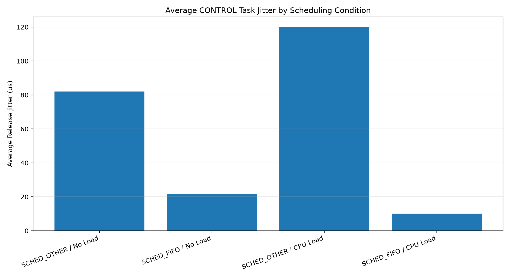
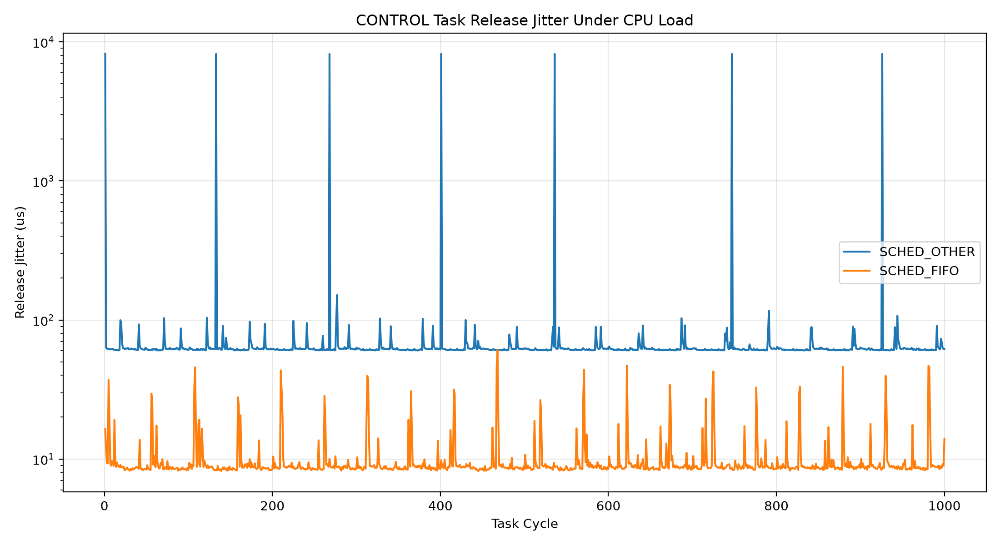
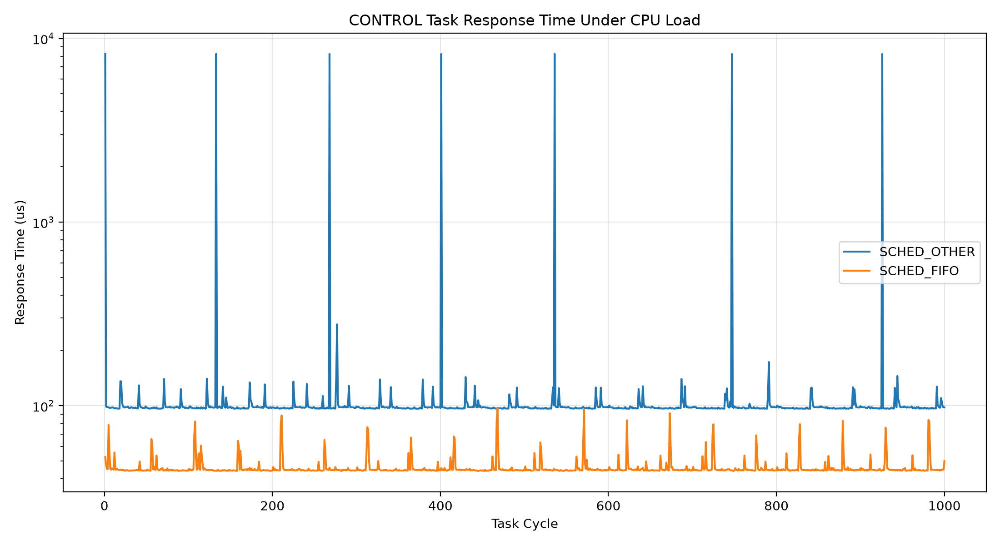
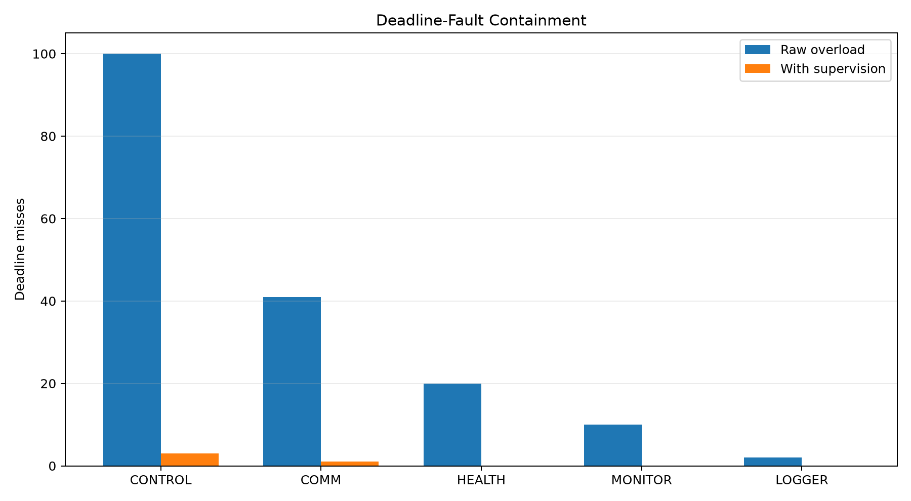
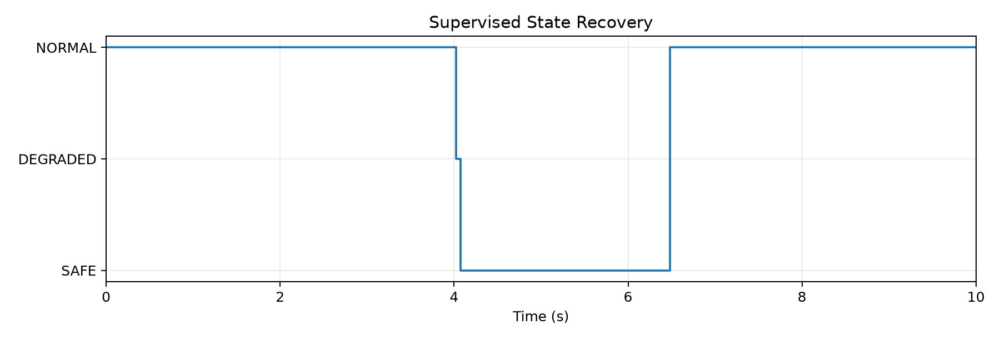
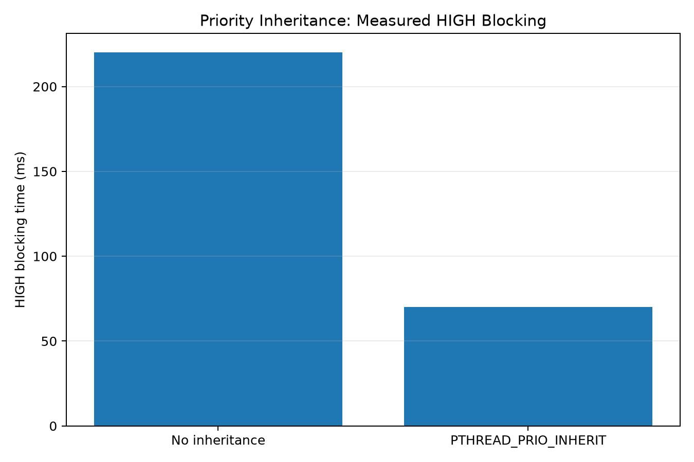
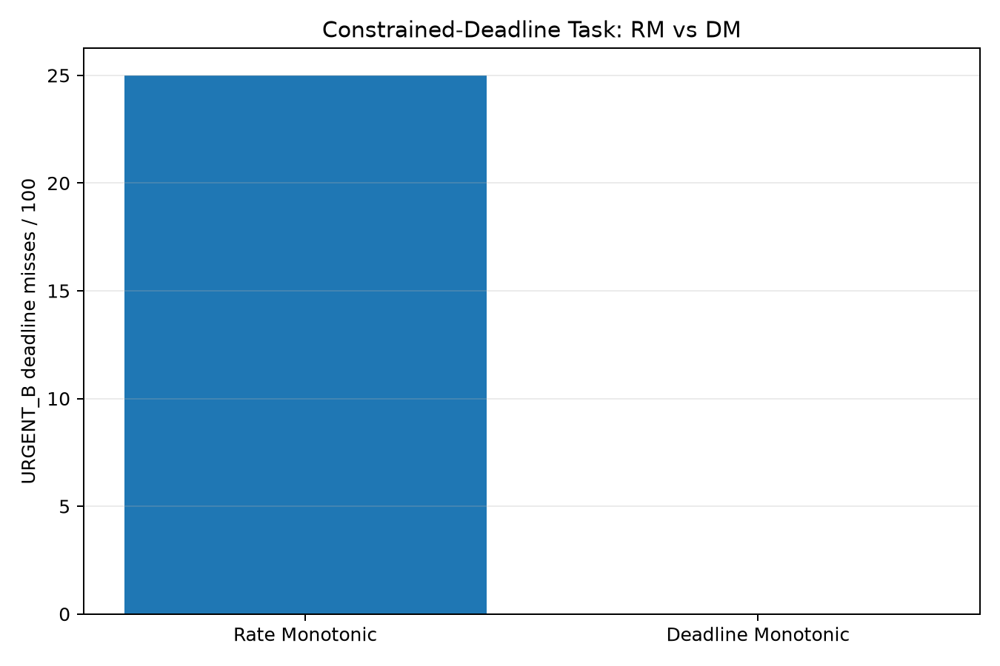
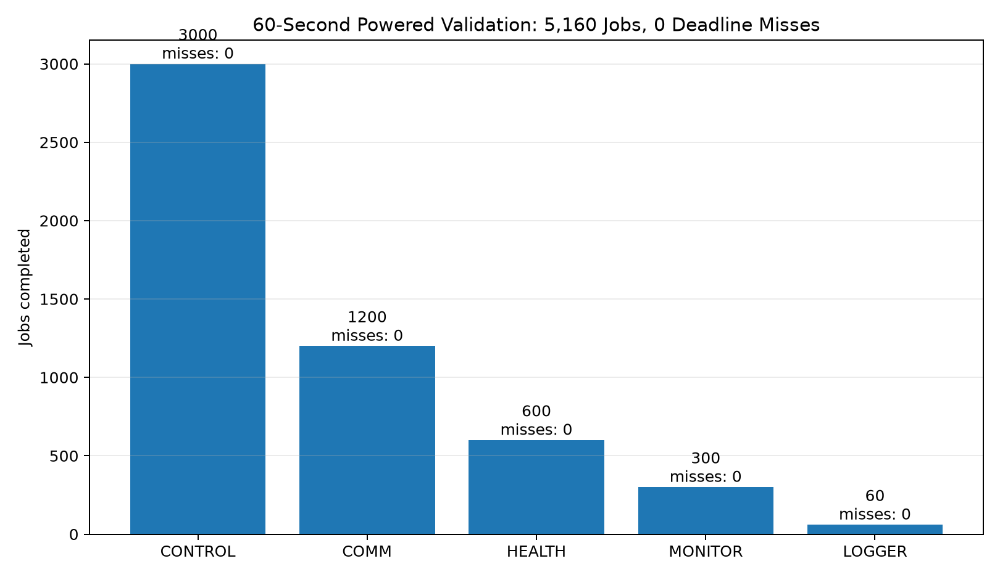
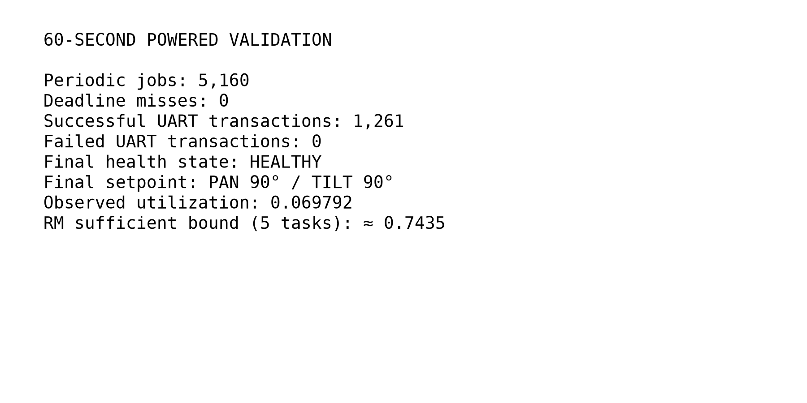

# Experiment Notes

This page records the detailed measurements behind the main README. Every linked artifact below exists in the repository.

## 1. CONTROL scheduling baseline

The CONTROL task uses a 20 ms period and 20 ms deadline.

Measured timing:

| Condition | Average jitter | Worst jitter | Average response | Worst response | Deadline misses |
|---|---:|---:|---:|---:|---:|
| SCHED_OTHER / no load | 82.074 µs | 212.422 µs | 164.325 µs | 296.953 µs | 0 / 1000 |
| SCHED_FIFO / no load | 21.618 µs | 77.969 µs | 101.880 µs | 196.288 µs | 0 / 1000 |
| SCHED_OTHER / CPU load | 120.019 µs | 8203.196 µs | 156.095 µs | 8239.341 µs | 0 / 1000 |
| SCHED_FIFO / CPU load | 10.052 µs | 60.820 µs | 46.066 µs | 97.278 µs | 0 / 1000 |

Figures:







Raw CSV data:

- [SCHED_OTHER baseline](../results/csv/control_timing_sched_other_baseline.csv)
- [SCHED_FIFO baseline](../results/csv/control_timing_sched_fifo_baseline.csv)
- [SCHED_OTHER under CPU load](../results/csv/control_timing_sched_other_load.csv)
- [SCHED_FIFO under CPU load](../results/csv/control_timing_sched_fifo_load.csv)

## 2. Physical UART integration

The Raspberry Pi real-time scheduler communicates with the TM4C123 actuator node over UART.

[Open physical PAN/TILT demonstration](media/06-integration/02-realtime-pan-tilt-demo.mp4)

[](media/06-integration/02-realtime-pan-tilt-demo.mp4)

## 3. Communication-loss safety design

The TM4C123 has a local 300 ms communication watchdog. When valid Raspberry Pi commands stop arriving, the MCU independently returns both actuators to the 90° safe center.

This behavior is implemented in:

- [TM4C123 firmware](../src/tm4c123/main.c)
- [Watchdog fault test](../tests/watchdog_fault_test.py)
- [Raspberry Pi fault-tolerant supervisor](../src/raspberry_pi/fault_tolerance/rt_fault_tolerant.c)

## 4. Raw CONTROL deadline fault

A 25 ms workload was deliberately inserted into CONTROL, which has a 20 ms period/deadline.

Raw result:

| Service | Deadline misses |
|---|---:|
| CONTROL | 100 / 500 |
| COMM | 41 / 200 |
| HEALTH | 20 / 100 |
| MONITOR | 10 / 50 |
| LOGGER | 2 / 10 |

The high-priority overload created cascading delays through the lower-priority services.

Source:

- [Raw deadline-fault experiment](../src/raspberry_pi/experiments/rt_deadline_fault_raw.c)

## 5. Supervised timing-fault recovery

The supervisor monitors CONTROL timing directly. Three consecutive CONTROL misses trigger the SAFE state. The faulty workload is shed, new actuator motion is inhibited, and recovery requires a stable timing interval.

Measured state transitions:

```text
t=4.025 s | NORMAL   -> DEGRADED | CONTROL_DEADLINE_OVERRUN
t=4.075 s | DEGRADED -> SAFE     | CONTROL_DEADLINE_OVERRUN
t=6.480 s | SAFE     -> NORMAL   | NONE
```

After supervision:

| Service | Deadline misses |
|---|---:|
| CONTROL | 3 / 500 |
| COMM | 1 / 200 |
| HEALTH | 0 / 100 |
| MONITOR | 0 / 50 |
| LOGGER | 0 / 10 |





Source:

- [Supervised timing-fault implementation](../src/raspberry_pi/fault_tolerance/rt_timing_fault_supervised.c)

## 6. Priority inversion

Three single-core `SCHED_FIFO` threads were used:

```text
HIGH   = 80
MEDIUM = 60
LOW    = 40
```

Without priority inheritance:

```text
HIGH blocking time = 220.222 ms
```

With `PTHREAD_PRIO_INHERIT`:

```text
HIGH blocking time = 70.119 ms
```

Measured blocking reduction: **68.16%**.



Source:

- [Priority inversion experiment](../src/raspberry_pi/experiments/priority_inversion_test.c)

## 7. Rate Monotonic vs Deadline Monotonic

Task set:

| Task | Execution | Period | Deadline |
|---|---:|---:|---:|
| FAST_A | 8 ms | 40 ms | 40 ms |
| URGENT_B | 8 ms | 50 ms | 12 ms |
| SLOW_C | 4 ms | 100 ms | 100 ms |

For `URGENT_B`:

| Policy | Priority | Deadline misses | Worst response |
|---|---:|---:|---:|
| Rate Monotonic | 70 | 25 / 100 | 16.083 ms |
| Deadline Monotonic | 80 | 0 / 100 | 8.112 ms |



Source:

- [RM vs DM experiment](../src/raspberry_pi/experiments/rm_vs_dm_test.c)

## 8. 60-second powered validation

Final physical validation:

```text
CONTROL : 0 / 3000 deadline misses
COMM    : 0 / 1200
HEALTH  : 0 / 600
MONITOR : 0 / 300
LOGGER  : 0 / 60

Successful UART transactions : 1261
Failed UART transactions     : 0
Consecutive failures         : 0
HEALTH state                 : HEALTHY

PAN  : 90 degrees
TILT : 90 degrees

Sum(C_i / T_i) = 0.069792
```





Raw logs:

- [Final 60-second validation](../results/logs/final_60s_validation.txt)
- [Final 60-second powered physical validation](../results/logs/final_60s_physical_validation.txt)

Source:

- [Long-run validation program](../src/raspberry_pi/experiments/rt_long_run_validation.c)
